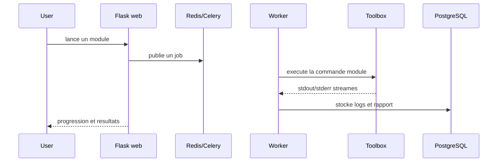

# TSAR Architecture

TSAR centralise l'execution d'outils de securite dans un environnement isole.
L'objectif n'est pas de remplacer l'expertise d'un pentester, mais de rendre les
collectes repetables, tracables et presentables dans un rapport.

## Composants

| Composant | Role |
| --- | --- |
| Flask web | Interface, authentification, gestion des projets et consultation des rapports. |
| Celery worker | Execution asynchrone des jobs longs. |
| Redis | Broker Celery et streaming temps reel des logs. |
| PostgreSQL | Stockage des projets, logs, vulnerabilites et metadonnees de rapports. |
| Toolbox | Conteneur d'outils qui execute les commandes de scan. |

## Flux d'execution

## Posture securite

- Les commandes sont definies dans des modules Python versionnes.
- Les scans s'executent dans un conteneur dedie, pas directement sur l'hote.
- Les rapports PDF sont chiffres au repos.
- L'authentification repose sur Auth0 pour eviter de gerer localement les mots
  de passe applicatifs.

## Limites assumees

- TSAR doit etre utilise uniquement sur un perimetre autorise.
- Les modules peuvent appeler des outils intrusifs ; la validation humaine reste
  necessaire avant execution.
- Le modele actuel privilegie un deploiement local/lab. Un usage multi-tenant
  demanderait une isolation supplementaire par mission.

